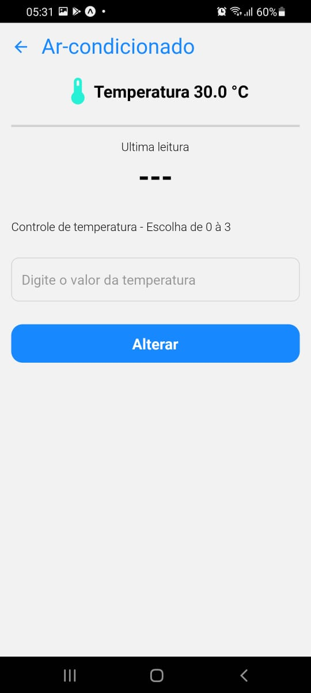

# RabbiMQ e GPRC

# Equipe 16

# OBJETIVO

O objetivo deste trabalho é consolidar o conhecimento dos alunos sobre invocação de métodos remotos e comunicação indireta, além das ferramentas RabbitMQ e gRPC, através de um trabalho prático que envolva ambas.

# Arquitetura

# Aplicação

# Links

Apresentação e slides encontram-se no link abaixo (Somente dominio da UFC)

link = https://drive.google.com/drive/folders/1TAdmkSO57esqOOoQfmYnITyGbhgJTz5E?usp=sharing
